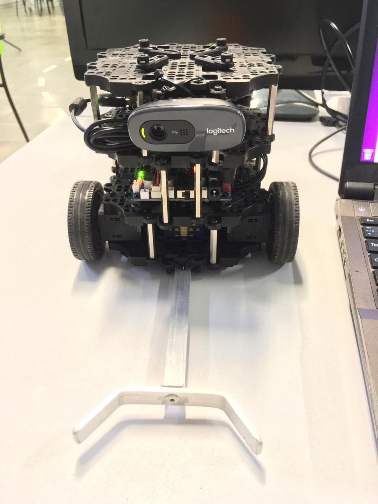
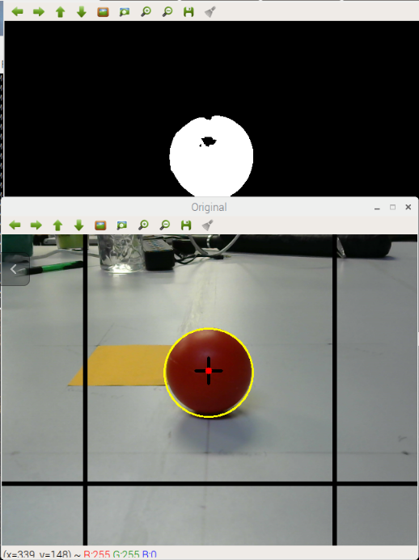

# burguer_soccer
Turtlebot3 Burguer ball follower

Install usb_cam

    sudo apt-get install ros-kinetic-usb-cam 
 
Edit usb_cam resolution on ../usb_cam/launch/usb_cam-test.launch
    
    <param name="image_width" value="160" />
    <param name="image_height" value="120" />
  
Execute
    
    roslaunch usb_cam usb_cam-test.launch
    roslaunch turtlebot3_bringup turtlebot3_robot.launch
    rosrun burguer_soccer find_ball.py
    rosrun burguer_soccer decision_making.py

